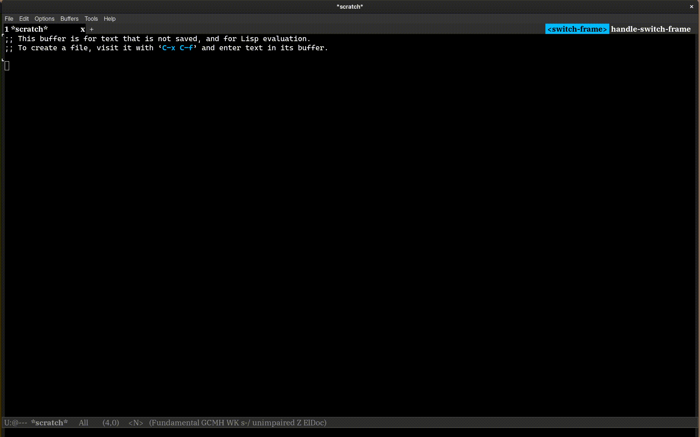

# Emacs interface to the rapyuta.io

This package provides:
- A comprehensive transient-based UI for the rapyuta.io `rio` CLI.
- Support for managing organization resources: Organizations, Projects, and Usergroups.
- Support for managing rapyuta.io resources: Deployments, Packages, Disks, Devices, Networks, Secrets, StaticRoutes.
- Authentication flows and Ephemeral environment support.
- VPN management.
- Manifest operations including chart support.
- A TRAMP backend (`/hwil:`) for Hardware-in-the-Loop devices.

## Requirements
- Emacs 29.1+
- `transient` 0.4.0+
- The external `rio` CLI installed and on PATH
- Optional: tree-sitter modes `yaml-ts-mode`, `json-ts-mode`

## Installation

```elisp
(use-package rio
  :vc ( :url "https://github.com/rapyuta-robotics/rapyuta-io-cli"
		:rev :latest
		:lisp-dir "lisp")
  :bind
  ("C-c r" . rio-transient))
```

## Quick Start

1. Run `M-x rio-transient`
2. Authenticate: a → l (Auth → Login)
3. Select organization & project when prompted
4. Explore resources (Packages, Deployments, Devices, Networks, etc.)
5. Apply manifests: + → m
6. Inspect resources with RET in list buffers


## HWIL TRAMP Integration

Enable with:

```elisp
(use-package tramp-rio
  :config
  (tramp-rio-hwil-setup))
```

Open a remote file:

```
C-x C-f /hwil:DEVICE_NAME:/etc/hostname
```


## Customization

`M-x customize-group RET rio RET`

Variable:

- `rio-command` (defaults to first `rio` in PATH)

## Demo

<details>
  <summary>Ephemeral environment and Authentication</summary>



</details>

<details>
  <summary>Apply Operations</summary>


</details>

<details>
  <summary>Resource Operations</summary>


</details>

<details>
  <summary>VPN Support</summary>


</details>

<details>
  <summary>HWIL Support</summary>


</details>

---

Happy automating with rapyuta.io from inside Emacs!
